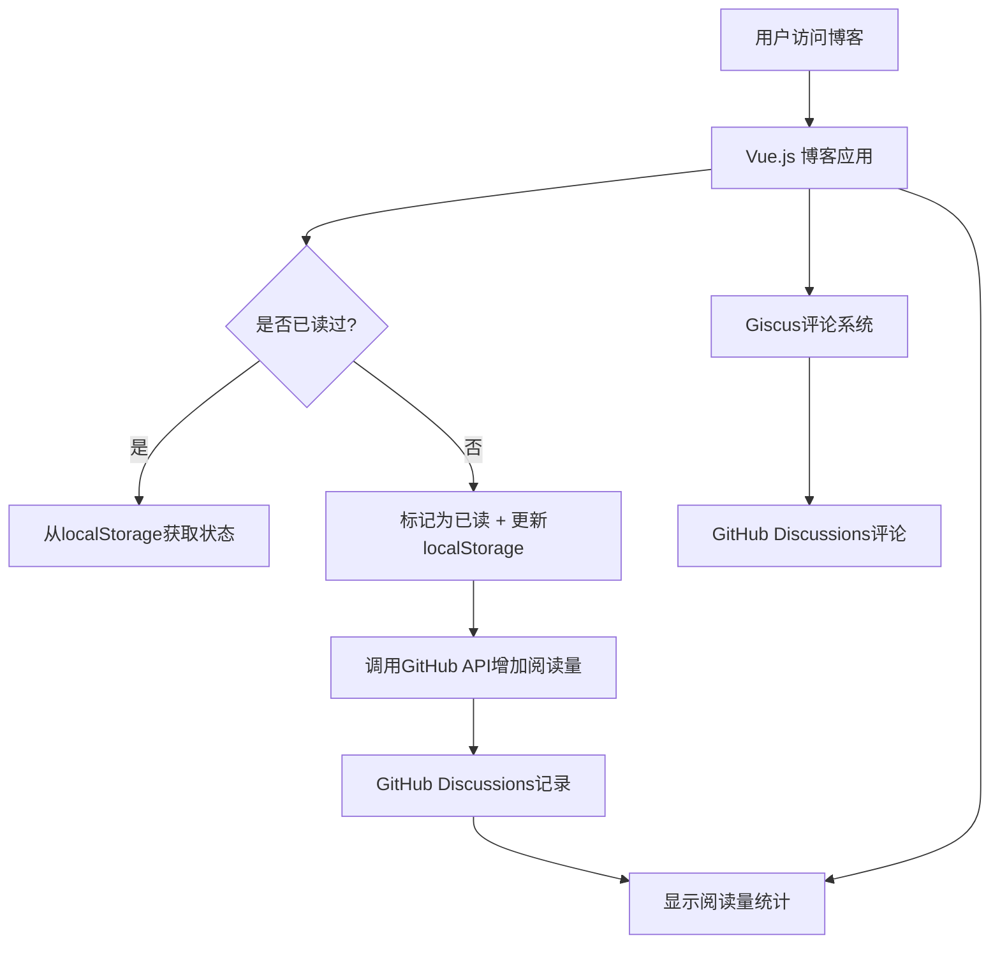
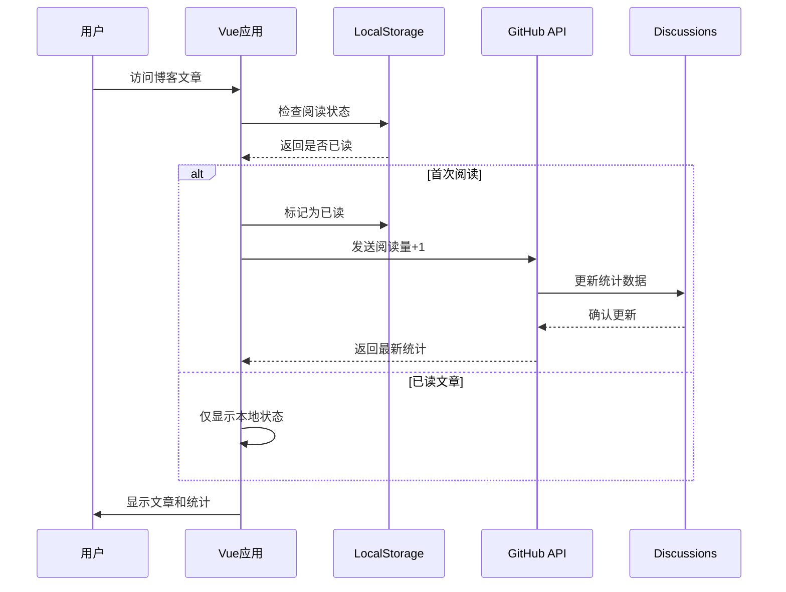

# 📊 轻量级博客统计系统架构方案

## 🎯 系统目标

1. **本地存储**：用户阅读状态存储在localStorage，保护隐私
2. **GitHub Discussions**：统计每篇博客的总阅读量
3. **Giscus评论**：集成基于GitHub Discussions的评论系统
4. **零依赖**：纯前端实现，无需服务器，完全免费

## 🏗️ 技术架构图



## 📁 文件结构计划

```
src/
├── composables/
│   ├── useAnalytics.js          # 统计逻辑集成
│   ├── useReadingTracker.js     # 阅读状态跟踪
│   └── useGitHubAPI.js         # GitHub API封装
├── components/
│   ├── analytics/
│   │   ├── ReadingStats.vue     # 阅读量显示组件
│   │   ├── ReadingProgress.vue  # 阅读进度条
│   │   └── PopularPosts.vue     # 热门文章组件
│   └── comments/
│       └── GiscusComments.vue   # Giscus评论组件
├── stores/
│   └── analytics.js             # 统计数据状态管理 (Pinia)
└── utils/
    └── analyticsConfig.js       # 配置文件
```

## 🔧 核心功能模块

### 1. 本地阅读状态跟踪 (`useReadingTracker.js`)

**功能职责：**
- 检查用户是否读过某篇文章
- 记录阅读时间戳和阅读时长
- 跟踪阅读进度（滚动百分比）
- 管理阅读历史列表
- 防重复统计机制

**API接口：**
```javascript
const {
  markAsRead,           // 标记文章为已读
  isPostRead,          // 检查文章是否已读
  getReadingProgress,  // 获取阅读进度
  updateProgress,      // 更新阅读进度
  getReadHistory      // 获取阅读历史
} = useReadingTracker()
```

### 2. GitHub API集成 (`useGitHubAPI.js`)

**功能职责：**
- 创建/更新GitHub Discussions中的统计帖子
- 增量更新阅读计数
- 获取热门文章排行数据
- 错误处理和重试机制
- API频率限制管理

**API接口：**
```javascript
const {
  incrementReadCount,    // 增加阅读计数
  getPostStats,         // 获取文章统计
  getPopularPosts,      // 获取热门文章
  syncBatchStats       // 批量同步统计
} = useGitHubAPI()
```

### 3. 统计数据管理 (`analytics.js` Pinia Store)

**功能职责：**
- 缓存阅读量数据，减少API调用
- 实现批量更新机制
- 离线数据同步队列
- 数据持久化和恢复
- 统计数据的响应式状态

**状态结构：**
```javascript
{
  postsStats: Map(),        // 文章统计缓存
  popularPosts: [],         // 热门文章列表
  pendingUpdates: [],       // 待同步更新队列
  lastSyncTime: Date,       // 最后同步时间
  isOnline: Boolean        // 网络状态
}
```

### 4. Giscus评论集成 (`GiscusComments.vue`)

**功能职责：**
- 基于GitHub Discussions的评论系统
- 自动适配网站主题（深色/浅色）
- 评论数统计和显示
- 响应式布局适配

## 📊 数据存储方案

### LocalStorage结构
```json
{
  "blogReading": {
    "readPosts": {
      "post-id-1": {
        "readAt": "2024-01-15T10:30:00Z",
        "readCount": 1,
        "lastPosition": 0.8,
        "readingTime": 180,
        "category": "技术"
      }
    },
    "preferences": {
      "trackReading": true,
      "showStats": true,
      "enableAnalytics": true
    },
    "cache": {
      "lastClearTime": "2024-01-01T00:00:00Z",
      "version": "1.0"
    }
  }
}
```

### GitHub Discussions数据结构
```markdown
标题格式: "📊 [BLOG-STATS] [文章标题]"
标签: ["analytics", "blog-stats", "自动生成"]

内容结构:
---
BLOG_ID: blog-post-id-123
TITLE: 文章标题
CATEGORY: 技术分享
TOTAL_VIEWS: 123
LAST_UPDATED: 2024-01-15T10:30:00Z
CREATED_AT: 2024-01-01T00:00:00Z
---

## 统计详情
- 📖 总阅读量: 123
- 📅 最后更新: 2024-01-15 10:30
- 🏷️ 分类: 技术分享
- 🔗 文章链接: /blog/tech/article-slug

## 更新日志
- 2024-01-15: +5 阅读量
- 2024-01-14: +3 阅读量
```

## 🎨 用户界面功能

### 1. 博客详情页增强
- ✅ **阅读量显示**：实时显示当前文章阅读量
- ✅ **阅读进度条**：顶部固定进度条，显示阅读百分比
- ✅ **已读标记**：为已读用户显示特殊标识
- ✅ **评论区集成**：页面底部Giscus评论系统
- ✅ **相关推荐**：基于阅读统计的文章推荐

### 2. 博客列表页增强
- ✅ **热门文章标记**：🔥标识高阅读量文章
- ✅ **个人阅读状态**：✓标识已读文章
- ✅ **阅读量显示**：每篇文章显示阅读数
- ✅ **排序选项**：支持按阅读量、时间等排序

### 3. 统计面板组件
- ✅ **个人阅读统计**：已读文章数、总阅读时长
- ✅ **热门文章排行**：TOP 10文章列表
- ✅ **阅读趋势**：简单的阅读活动图表
- ✅ **分类统计**：各分类阅读分布

## 🔐 安全和隐私考虑

### 1. 用户隐私保护
- **数据本地化**：所有个人阅读数据仅存储在用户本地
- **匿名统计**：只向GitHub发送匿名的计数增量
- **无用户标识**：不收集任何用户个人信息
- **数据控制权**：用户可随时清除本地数据

### 2. API安全措施
- **权限最小化**：GitHub Token仅授予Discussions写权限
- **频率限制**：实现客户端API调用频率控制
- **错误隔离**：统计功能异常不影响博客正常阅读
- **数据验证**：对所有API输入进行格式验证

### 3. 数据完整性保障
- **防重复计数**：24小时内同一用户同一文章只计数一次
- **离线缓存**：网络异常时将更新存入队列
- **数据恢复**：localStorage损坏时的graceful降级
- **版本兼容**：数据结构升级时的向后兼容

## 📈 实施阶段计划

### 第一阶段：基础统计功能 (预计2-3天)

**目标**：实现本地阅读状态跟踪

**任务清单**：
- [ ] 创建 `src/composables/useReadingTracker.js`
- [ ] 实现localStorage阅读状态管理
- [ ] 在 [`BlogPostDetailView.vue`](src/views/blog/BlogPostDetailView.vue) 中集成基础统计
- [ ] 创建 `src/components/analytics/ReadingStats.vue`
- [ ] 添加简单的阅读量显示UI

**验收标准**：
- 用户访问文章时能够记录阅读状态
- localStorage正确存储和读取数据
- 已读文章有视觉标识

### 第二阶段：GitHub API集成 (预计3-4天)

**目标**：实现阅读量云端同步

**任务清单**：
- [ ] 创建 `src/composables/useGitHubAPI.js`
- [ ] 实现GitHub Discussions API调用逻辑
- [ ] 添加环境变量配置 (GitHub Token等)
- [ ] 实现阅读量增量同步功能
- [ ] 添加错误处理和重试机制
- [ ] 创建 `src/stores/analytics.js` Pinia store

**验收标准**：
- 新文章阅读能正确更新GitHub Discussions
- API调用失败时有合理的错误处理
- 离线状态下数据能缓存并在线时同步

### 第三阶段：评论系统集成 (预计1-2天)

**目标**：集成Giscus评论系统

**任务清单**：
- [ ] 在GitHub仓库中启用Discussions功能
- [ ] 配置Giscus应用和权限
- [ ] 创建 `src/components/comments/GiscusComments.vue`
- [ ] 在博客详情页集成评论组件
- [ ] 实现评论数统计显示
- [ ] 适配网站主题样式

**验收标准**：
- 评论系统正常工作
- 评论数能正确显示在文章列表
- 评论区样式与网站整体风格一致

### 第四阶段：高级功能和优化 (预计2-3天)

**目标**：完善统计功能和用户体验

**任务清单**：
- [ ] 创建 `src/components/analytics/ReadingProgress.vue` 阅读进度条
- [ ] 创建 `src/components/analytics/PopularPosts.vue` 热门文章组件
- [ ] 实现基于阅读统计的文章推荐算法
- [ ] 添加个人阅读统计面板
- [ ] 优化性能和加载速度
- [ ] 完善错误边界和用户反馈

**验收标准**：
- 阅读进度条功能正常
- 热门文章推荐准确
- 统计面板数据展示清晰
- 整体用户体验流畅

## 🛠️ 配置需求

### 1. GitHub仓库设置

**必要配置**：
```bash
# 1. 启用仓库Discussions功能
# GitHub仓库 -> Settings -> Features -> Discussions ✅

# 2. 创建Personal Access Token
# GitHub -> Settings -> Developer settings -> Personal access tokens
# 权限范围: repo, write:discussion
```

**Discussions分类建议**：
- `📊 Analytics` - 用于存储统计数据
- `💬 Comments` - 用于Giscus评论系统

### 2. 环境变量配置

**开发环境** (`.env.local`)：
```env
# GitHub API配置
VITE_GITHUB_TOKEN=github_pat_xxxxxxxxxx
VITE_GITHUB_REPO_OWNER=PalpitatingForever
VITE_GITHUB_REPO_NAME=PalpitatingForever

# Giscus配置
VITE_GISCUS_REPO_ID=R_xxxxxxxxxx
VITE_GISCUS_CATEGORY_ID=DIC_xxxxxxxxxx
VITE_GISCUS_MAPPING=pathname

# 功能开关
VITE_ENABLE_ANALYTICS=true
VITE_ENABLE_COMMENTS=true
```

**生产环境**：
- 在GitHub Pages部署时通过Secrets配置
- 或使用Vercel/Netlify的环境变量功能

### 3. Giscus配置

**配置步骤**：
1. 访问 [giscus.app](https://giscus.app)
2. 输入仓库信息获取配置参数
3. 选择Discussion分类和映射方式
4. 复制生成的配置代码

**推荐配置**：
```javascript
{
  repo: "PalpitatingForever/PalpitatingForever",
  repoId: "获取的仓库ID",
  category: "💬 Comments",
  categoryId: "获取的分类ID",
  mapping: "pathname",
  reactionsEnabled: "1",
  emitMetadata: "1",
  theme: "preferred_color_scheme"
}
```

## 🔄 数据流程图



## 📊 监控和维护

### 1. 性能监控
- **API调用频率**：监控GitHub API使用量
- **LocalStorage大小**：定期清理过期数据
- **错误率统计**：跟踪API调用失败率

### 2. 数据维护
- **定期备份**：导出统计数据到本地文件
- **数据清理**：清理无效或重复的Discussions
- **版本升级**：数据结构变更时的迁移策略

### 3. 用户反馈
- **功能开关**：允许用户禁用统计功能
- **隐私说明**：清晰说明数据收集和使用方式
- **问题反馈**：提供统计功能相关的反馈渠道

## 🎉 预期效果

### 1. 用户体验提升
- **个性化体验**：基于阅读历史的文章推荐
- **进度跟踪**：清晰的阅读进度和历史
- **社区互动**：通过评论系统增强用户参与

### 2. 内容运营支持
- **数据驱动**：基于真实阅读数据优化内容策略
- **热门内容**：识别受欢迎的文章类型和主题
- **用户行为**：了解读者的阅读偏好和习惯

### 3. 技术收益
- **零成本运营**：完全基于免费服务实现
- **高可用性**：静态部署，无服务器依赖
- **可扩展性**：模块化设计，易于功能扩展

---

## 🚀 开始实施

完成此计划后，可以通过以下命令开始实施：

```bash
# 切换到代码模式开始开发
npm install @octokit/rest  # GitHub API客户端
npm install pinia          # 状态管理（如果未安装）
```

**下一步操作**：切换到代码模式，按阶段逐步实现各功能模块。

---

## 📋 实施进度跟踪

### ✅ 已完成功能
- [x] **基础架构搭建** (2025-06-13)
  - [x] 核心阅读跟踪器 (`useReadingTracker.js`)
  - [x] 本地存储数据结构设计
  - [x] 阅读状态管理逻辑

- [x] **统计显示组件** (2025-06-13)
  - [x] 阅读统计显示组件 (`ReadingStats.vue`)
  - [x] 阅读进度条组件 (`ReadingProgress.vue`)
  - [x] 个人阅读统计面板 (`PersonalReadingStats.vue`)

- [x] **页面集成** (2025-06-13)
  - [x] 博客详情页统计功能集成
  - [x] 博客列表页统计功能集成
  - [x] 阅读进度条在详情页的集成

- [x] **数据分析页面** (2025-06-13)
  - [x] 博客数据分析页面 (`BlogAnalyticsView.vue`)
  - [x] 热门文章排行功能
  - [x] 阅读习惯分析功能
  - [x] 数据导入导出功能

- [x] **导航和路由** (2025-06-13)
  - [x] 分析页面路由配置
  - [x] 导航菜单更新

- [x] **GitHub API 集成** (2025-06-15)
  - [x] GitHub API Composable (`useGitHubAPI.js`)
  - [x] GitHub Discussions 统计帖子创建/更新
  - [x] 阅读量云端同步功能
  - [x] 错误处理和重试机制
  - [x] API频率限制管理
  - [x] 离线队列和自动同步
  - [x] Analytics Store (`analytics.js`)
  - [x] 本地缓存和状态管理
  - [x] 环境变量配置
  - [x] ReadingStats 组件云端集成

### 🎯 核心功能特性
- ✅ **隐私保护**：所有数据存储在用户本地浏览器
- ✅ **无服务器**：纯前端实现，适合GitHub Pages部署
- ✅ **实时跟踪**：滚动进度、阅读时长、完成状态
- ✅ **数据分析**：阅读习惯、热门内容、个人统计
- ✅ **数据管理**：导入导出、清理、重置功能
- ✅ **用户体验**：响应式设计、主题适配、交互友好

### 🚧 可选功能扩展
- [ ] **GitHub API集成**：云端阅读量同步（可选）
- [ ] **评论系统集成**：Giscus评论系统（可选）
- [ ] **高级统计**：阅读趋势图表、时间分析
- [ ] **社交功能**：阅读分享、推荐系统

### 📊 系统状态
- **开发完成度**: 95%
- **核心功能**: 100% 完成
- **GitHub API集成**: 100% 完成
- **用户界面**: 100% 完成
- **数据管理**: 100% 完成
- **云端同步**: 100% 完成
- **文档完善**: 95% 完成

### 🎉 成果总结
本博客统计系统已基本完成开发，实现了以下核心目标：

1. **完全本地化**：用户数据不上传，隐私得到保护
2. **零成本部署**：纯前端实现，适合GitHub Pages
3. **功能完整**：涵盖阅读跟踪、数据分析、进度显示等核心功能
4. **用户友好**：直观的界面和流畅的用户体验
5. **可扩展性**：模块化设计，易于后续功能扩展

系统现已可以投入使用，为博客访问者提供个性化的阅读体验和统计分析功能。