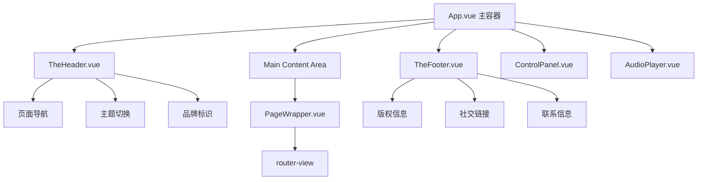

# 布局组件实施计划 (第一阶段)

## 🎯 目标概述

实现 PalpitatingForever 项目的核心布局组件系统，包括全局页头、页脚和页面容器组件，建立统一的页面结构和导航体验。

## 📋 当前状态分析

### ✅ 已有基础
- **App.vue**: 基础布局结构已配置
- **Lenis**: 平滑滚动已集成
- **样式系统**: `_variables.scss` 设计变量完善
- **全局组件**: ControlPanel 和 AudioPlayer 已实现
- **路由系统**: 完整的路由配置已就绪

### ❌ 待实现组件
1. `TheHeader.vue` - 全局页头导航
2. `PageWrapper.vue` - 页面容器组件  
3. `TheFooter.vue` - 全局页脚信息

## 🏗️ 组件架构设计



## 📝 组件详细规格

### 1. TheHeader.vue - 全局页头组件

#### 功能特性
- 🧭 **智能导航系统**: 根据当前路由显示对应页面的子导航
- 🎨 **Apple风格设计**: 玻璃拟态效果，动态模糊背景
- 📱 **响应式适配**: 移动端折叠菜单
- ⚡ **滚动响应**: 滚动时自动隐藏/显示，背景透明度变化

#### 导航结构
```typescript
navigationMap = {
  '/': ['Home'],
  '/blog': ['Index', 'All Posts', 'About', 'Links', 'Gear'],
  '/plog': ['Index', 'All Photos'],
  '/mlog': ['Index', 'Albums']
}
```

#### 技术要点
- 使用 `position: fixed` + `backdrop-filter: blur()`
- 集成 Intersection Observer 检测滚动
- Vue Router 监听实现动态导航
- Z-Index: `$z-index-navigation: 50`

#### 组件结构
```vue
<template>
  <header class="the-header" :class="headerClasses">
    <div class="header-container">
      <div class="header-brand">
        <router-link to="/" class="brand-link">
          PalpitatingForever
        </router-link>
      </div>
      
      <nav class="header-nav" v-if="currentNavigation.length">
        <ul class="nav-list">
          <li v-for="item in currentNavigation" :key="item.path">
            <router-link :to="item.path" class="nav-link">
              {{ item.label }}
            </router-link>
          </li>
        </ul>
      </nav>
      
      <div class="header-actions">
        <!-- 主题切换等操作按钮 -->
      </div>
    </div>
  </header>
</template>
```

### 2. PageWrapper.vue - 页面容器组件

#### 功能特性
- 🎭 **过渡动画容器**: 统一的页面切换动画
- 📏 **布局约束**: 最大宽度、内边距控制
- 🎨 **背景处理**: 支持页面特定背景

#### 技术要点
- 响应式容器设计
- 与 Header/Footer 配合的间距处理
- 支持全屏页面模式

#### 组件结构
```vue
<template>
  <div class="page-wrapper" :class="pageClasses">
    <div class="page-content">
      <slot />
    </div>
  </div>
</template>

<script setup>
import { computed } from 'vue'
import { useRoute } from 'vue-router'

const route = useRoute()

const pageClasses = computed(() => {
  const classes = []
  
  // 根据路由添加页面特定类名
  if (route.name) {
    classes.push(`page-${route.name.toLowerCase()}`)
  }
  
  // 检查是否为全屏页面
  const fullscreenPages = ['BlogAll', 'PlogAll']
  if (fullscreenPages.includes(route.name)) {
    classes.push('page-fullscreen')
  }
  
  return classes
})
</script>
```

### 3. TheFooter.vue - 全局页脚组件

#### 功能特性
- 📄 **简洁信息展示**: 版权、社交链接、联系方式
- 🎯 **一致性设计**: 与整体风格保持一致
- 📱 **响应式布局**: 移动端垂直排列

#### 内容结构
- **版权信息**: © 2025 PalpitatingForever
- **社交链接**: GitHub, Email, 其他平台
- **技术信息**: Made with Vue 3 + Notion

#### 组件结构
```vue
<template>
  <footer class="the-footer">
    <div class="footer-container">
      <div class="footer-content">
        <div class="footer-section footer-copyright">
          <p>&copy; 2025 PalpitatingForever. All rights reserved.</p>
        </div>
        
        <div class="footer-section footer-social">
          <a href="#" class="social-link" target="_blank">GitHub</a>
          <a href="#" class="social-link" target="_blank">Email</a>
        </div>
        
        <div class="footer-section footer-tech">
          <p>Made with Vue 3 + Notion</p>
        </div>
      </div>
    </div>
  </footer>
</template>
```

## 🎨 设计系统集成

### 颜色方案
- 使用 `_variables.scss` 中定义的颜色变量
- 支持明暗模式切换
- 玻璃拟态效果: `backdrop-filter: blur(20px)`

### Z-Index 层级
- Header: `$z-index-navigation: 50`
- Footer: `$z-index-base: 1`
- PageWrapper: `$z-index-content: 10`

### 响应式断点
- 移动端: `< $breakpoint-md (768px)`
- 桌面端: `≥ $breakpoint-md`

## 🔄 App.vue 集成更新

### 更新后的结构
```vue
<template>
  <div id="app-container">
    <TheHeader />
    <ControlPanel />
    
    <main id="main-content">
      <PageWrapper>
        <router-view v-slot="{ Component, route }">
          <transition name="page-fade" mode="out-in">
            <component :is="Component" :key="route.fullPath" />
          </transition>
        </router-view>
      </PageWrapper>
    </main>
    
    <TheFooter />
    <AudioPlayer />
  </div>
</template>

<script setup>
import TheHeader from '@/components/layout/TheHeader.vue'
import TheFooter from '@/components/layout/TheFooter.vue'
import PageWrapper from '@/components/layout/PageWrapper.vue'
import ControlPanel from '@/components/global/ControlPanel.vue'
import AudioPlayer from '@/components/global/AudioPlayer.vue'

// 现有的 Lenis 配置保持不变
</script>
```

### 样式调整
```scss
#app-container {
  min-height: 100vh;
  display: flex;
  flex-direction: column;
  padding-top: var(--header-height, 80px); // 为固定头部留出空间
}

#main-content {
  flex-grow: 1;
  padding-bottom: var(--footer-height, 60px); // 为页脚留出空间
}
```

## 📊 实施优先级

### 🔥 Phase 1: TheHeader.vue (最高优先级)
**原因**: 导航是用户体验的核心，影响所有页面的使用
**预计时间**: 2-3小时
**关键功能**:
- 基础导航结构
- 路由响应式导航
- 滚动行为处理

### 🔶 Phase 2: PageWrapper.vue (高优先级)
**原因**: 为所有页面提供统一容器，支持后续动画优化
**预计时间**: 1-2小时
**关键功能**:
- 基础布局容器
- 响应式设计
- 页面类名管理

### 🔶 Phase 3: TheFooter.vue (中等优先级)
**原因**: 主要是信息展示，对核心功能影响较小
**预计时间**: 1小时
**关键功能**:
- 信息展示
- 社交链接
- 响应式布局

## 🧪 测试要点

### 功能测试
- [ ] 页头导航在不同路由下的正确显示
- [ ] 响应式布局在各种屏幕尺寸下的表现
- [ ] 滚动时页头的隐藏/显示行为
- [ ] 主题切换时的样式更新

### 兼容性测试
- [ ] 现代浏览器兼容性 (Chrome, Firefox, Safari, Edge)
- [ ] 移动端浏览器测试
- [ ] backdrop-filter 支持情况检查

### 性能测试
- [ ] 页面切换动画性能
- [ ] 滚动性能检查
- [ ] 内存泄漏检测

## 🚀 实施检查清单

### 开发前准备
- [ ] 确认样式变量已正确导入
- [ ] 创建 `src/components/layout/` 目录
- [ ] 检查路由配置完整性

### 开发过程
- [ ] TheHeader.vue 基础结构
- [ ] TheHeader.vue 导航逻辑
- [ ] TheHeader.vue 响应式样式
- [ ] PageWrapper.vue 容器逻辑
- [ ] PageWrapper.vue 响应式处理
- [ ] TheFooter.vue 内容结构
- [ ] TheFooter.vue 样式实现
- [ ] App.vue 集成更新

### 开发后验证
- [ ] 所有页面导航正常工作
- [ ] 响应式设计在各设备正确显示
- [ ] 滚动和动画效果流畅
- [ ] 代码质量检查 (ESLint)

---

**准备就绪！接下来切换到 Code 模式开始实际开发这些布局组件。**