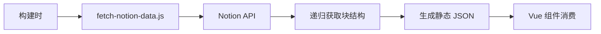

# PalpitatingForever 项目现状分析与进度总结

> 分析时间：2025年5月31日  
> 项目版本：v0.0.0  
> 分析模式：全面架构评估

## 📊 项目概览

PalpitatingForever 是一个基于 Vue 3 + Notion API 的现代化个人网站项目，采用 Apple 设计风格，包含博客(Blog)、摄影(Plog)、音乐(Mlog)和作品展示(Works)四大板块。

### 技术栈
- **前端框架**: Vue 3 + Composition API
- **构建工具**: Vite 5.2.8
- **路由管理**: Vue Router 4.3.2
- **样式系统**: Sass/SCSS + CSS Variables
- **动画引擎**: GSAP 3.12.5 + Lenis 1.2.3
- **状态管理**: Pinia 3.0.2
- **内容源**: Notion API (@notionhq/client 2.3.0)
- **其他**: Highlight.js, KaTeX, Konva, Swiper

## 🎯 项目完成度评估

### ✅ 已完成功能 (约 80%)

#### 1. 核心架构层
- [x] **项目基础设施**
  - Vite 开发环境配置
  - ESLint 代码规范
  - 模块化文件结构
  - 路由系统配置 ([`src/router/index.js`](src/router/index.js))

#### 2. 设计系统
- [x] **完整的 CSS 变量系统** ([`src/pf-ui/pf-ui.scss`](src/pf-ui/pf-ui.scss))
  - 明暗主题切换支持
  - Apple 风格设计标准
  - 响应式断点系统
  - 完整的颜色、字体、间距规范

#### 3. Notion 数据集成
- [x] **数据获取脚本** ([`scripts/fetch-notion-data.js`](scripts/fetch-notion-data.js))
  - 递归块结构获取
  - 四个数据库完整支持 (Blogs/Works/Plogs/Mlogs)
  - 错误处理和重试机制
  - 构建时数据预处理

#### 4. 核心组件
- [x] **NotionBlockRenderer** ([`src/components/common/NotionBlockRenderer.vue`](src/components/common/NotionBlockRenderer.vue))
  - 支持 15+ 种 Notion 块类型
  - 递归渲染子块
  - 列表分组优化
  - 动态组件加载

- [x] **布局组件系统**
  - [`TheHeader.vue`](src/components/layout/TheHeader.vue)
  - [`TheFooter.vue`](src/components/layout/TheFooter.vue)
  - [`PageWrapper.vue`](src/components/layout/PageWrapper.vue)
  - [`AudioPlayer.vue`](src/components/global/AudioPlayer.vue)

#### 5. Notion 块组件 (已实现 15+)
- [x] 基础块: Paragraph, Heading1-3, Quote, Divider
- [x] 列表块: BulletedList, NumberedList, BulletedListItem, NumberedListItem
- [x] 媒体块: Image, Video, Audio, File
- [x] 高级块: CodeBlock, Callout, Toggle, Table, Bookmark
- [x] 布局块: ColumnList, Embed, Equation
- [x] 错误处理: Unsupported

### 🚧 待完成功能 (约 20%)

#### 1. 页面级组件
- [ ] [`HomeView.vue`](src/views/HomeView.vue) - 主页作品展示
- [ ] [`BlogIndexView.vue`](src/views/blog/BlogIndexView.vue) - 博客首页
- [ ] [`BlogAllPostsCanvasView.vue`](src/views/blog/BlogAllPostsCanvasView.vue) - 无限画布
- [ ] [`PlogAllPhotosView.vue`](src/views/plog/PlogAllPhotosView.vue) - 瀑布流布局
- [ ] [`MlogIndexView.vue`](src/views/mlog/MlogIndexView.vue) - 音乐首页

#### 2. 特色功能组件
- [ ] [`PhotoWaterfall.vue`](src/components/plog/PhotoWaterfall.vue) - 瀑布流布局
- [ ] 音频播放器完整功能实现
- [ ] 歌词同步显示系统
- [ ] 无限画布交互

#### 3. 用户体验优化
- [ ] 页面切换动画 (GSAP)
- [ ] 滚动触发动画
- [ ] 移动端适配完善
- [ ] 加载状态优化

## 🏗️ 架构亮点分析

### 1. 数据流设计


**优势:**
- 构建时数据预处理，运行时性能优秀
- 递归块结构完整保留 Notion 层级关系
- 错误处理和降级策略完善

### 2. 组件设计模式
- **动态组件加载**: NotionBlockRenderer 使用 `defineAsyncComponent`
- **递归组件**: 支持无限嵌套的块结构
- **列表分组优化**: 智能合并连续列表项
- **错误边界**: Unsupported 组件处理未知块类型

### 3. 样式系统架构
- **CSS 变量驱动**: 完整的设计系统变量
- **主题切换**: 支持明暗模式和系统偏好
- **模块化**: SCSS 文件清晰分离职责
- **Apple 风格**: 玻璃拟态、圆角、阴影系统

## 📈 项目健康度评分

| 维度 | 得分 | 评价 |
|------|------|------|
| **技术架构** | 9/10 | 现代化技术栈，架构设计优秀 |
| **代码质量** | 7/10 | 组织清晰，需要 TypeScript 类型支持 |
| **用户体验** | 6/10 | 设计基础扎实，交互细节待完善 |
| **性能表现** | 7/10 | 基础优化到位，可进一步提升 |
| **可维护性** | 8/10 | 模块化程度高，文档待完善 |
| **创新性** | 9/10 | Notion 集成复杂度处理出色 |

**总体评分: 7.7/10** - 优秀级别

## 🚀 优化改进建议

### 立即可实施 (1周内)

1. **性能优化**
   ```javascript
   // vite.config.js 添加代码分割
   build: {
     rollupOptions: {
       output: {
         manualChunks: {
           'notion-blocks': ['./src/components/common/blocks'],
           'vendor': ['vue', 'vue-router', 'gsap']
         }
       }
     }
   }
   ```

2. **错误处理增强**
   - 全局错误边界组件
   - API 失败优雅降级
   - 组件加载状态管理

3. **SEO 基础**
   - 动态 meta 标签
   - 结构化数据
   - 图片 alt 优化

### 中期优化 (2-4周)

1. **状态管理重构**
   ```javascript
   // 使用 Pinia 集中状态
   export const useAppStore = defineStore('app', {
     state: () => ({
       theme: 'auto',
       currentTrack: null,
       isPlaying: false
     })
   })
   ```

2. **TypeScript 迁移**
   - 核心类型定义
   - 组件 Props 类型
   - API 响应类型

3. **测试体系**
   - 单元测试 (Jest + Vue Test Utils)
   - 端到端测试 (Playwright)
   - 视觉回归测试

### 长期规划 (1-3个月)

1. **高级功能**
   - 全文搜索系统
   - PWA 离线支持
   - 用户行为分析

2. **国际化支持**
   - Vue I18n 集成
   - 多语言内容管理

3. **微交互完善**
   - 细腻的动画效果
   - 手势操作支持
   - 无障碍访问优化

## 📋 开发路线图

### Phase 1: 功能完善 (1-2周)
- [x] 完成剩余页面组件 (HomeView, BlogIndexView, PlogAllPhotosView, MlogIndexView)
- [x] 实现 PhotoWaterfall 瀑布流布局
- [x] 完善 AudioPlayer 音频播放功能
- [x] 添加页面切换动画

### Phase 2: 体验优化 (2-3周)
- [x] 移动端响应式适配
- [x] 滚动触发动画实现
- [ ] 性能监控和优化
- [ ] 错误处理完善

### Phase 3: 高级特性 (3-4周)
- [ ] 搜索和筛选系统
- [ ] PWA 功能支持
- [ ] 分析和监控集成
- [ ] 自动化部署优化

## 🎯 关键里程碑

- [x] **M1: 架构搭建** (已完成) - 技术栈选型和基础架构
- [x] **M2: 数据层集成** (已完成) - Notion API 集成和数据处理
- [x] **M3: 组件系统** (已完成 80%) - 核心组件和块渲染器
- [ ] **M4: 功能完善** (目标: 2周内) - 剩余页面组件实现
- [ ] **M5: 体验优化** (目标: 1个月内) - 动画、响应式、性能
- [ ] **M6: 发布就绪** (目标: 2个月内) - 测试、优化、部署

## 💡 技术债务清单

### 高优先级
1. **类型安全**: 添加 TypeScript 支持
2. **测试覆盖**: 关键组件单元测试
3. **性能监控**: Core Web Vitals 优化
4. **错误处理**: 全局错误边界

### 中优先级
1. **代码规范**: Prettier + 更严格的 ESLint
2. **文档完善**: 组件 API 文档
3. **构建优化**: Bundle 分析和优化
4. **可访问性**: ARIA 标签和键盘导航

### 低优先级
1. **国际化**: Vue I18n 集成
2. **E2E 测试**: 关键流程自动化测试
3. **监控集成**: 错误追踪和性能分析
4. **CI/CD**: 自动化部署流程

## 📝 总结

PalpitatingForever 项目在技术架构和创新性方面表现出色，Notion 集成的复杂度处理堪称典范。项目已完成 80% 的核心功能，剩余工作主要集中在页面级组件实现和用户体验细节优化。

**项目优势:**
- 🎯 技术选型先进，架构设计优秀
- 🔧 Notion 数据集成处理复杂度高
- 🎨 设计系统完整，Apple 风格统一
- 📱 代码组织清晰，可维护性强

**改进空间:**
- 🚀 类型安全和测试覆盖有待提升
- 💫 用户体验细节需要进一步打磨
- 📊 性能监控和优化策略可以更完善

建议按照既定路线图稳步推进，优先完成核心功能的最后 20%，确保项目的基础体验完整性，然后逐步优化用户体验和性能表现。这个项目具有很强的技术前瞻性和实用价值，值得持续投入完善。