# 个人网站构建计划 (PalpitatingForever)

## 1. 目标

构建一个具有 Apple 设计风格、丰富动态效果、内容从 Notion 获取的个人网站。网站包含相对独立的**主页 (Home)**、**博客 (Blog)**、**摄影 (Plog)** 和**音乐 (Mlog)** 四大板块，每个板块下设多个子页面，并具备全局控制功能（如主题切换、导航、音乐播放等）。页面内容将直接渲染 Notion 的块结构。

## 2. 技术栈

*   **前端框架:** Vue 3
*   **构建工具:** Vite
*   **路由:** Vue Router
*   **样式:** Sass/SCSS
*   **动画:** GSAP, CSS Animations
*   **平滑滚动:** Lenis
*   **数据源:** Notion API (构建时获取)
*   **Notion SDK:** @notionhq/client
*   **环境配置:** dotenv
*   **状态管理:** (可选, e.g., Pinia for theme, player state)

## 3. Notion 数据源配置

### 3.1 环境变量 (`.env`)

```
NOTION_API_KEY=secret_YOUR_NOTION_API_KEY
NOTION_BLOGS_DATABASE_ID=1b7ec12aacd9802fafd6ff310eaa69d7
NOTION_WORKS_DATABASE_ID=1aaec12aacd9801aa9ede5ac19eab80e # 用于主页项目展示
NOTION_PLOGS_DATABASE_ID=1e3ec12aacd980fca7bfdaac70c8e905
NOTION_MLOGS_DATABASE_ID=1e3ec12aacd980bebe53f316201dd69c
```
*(确保已将数据库/页面分享给 Notion Integration)*

### 3.2 数据获取脚本 (`scripts/fetch-notion-data.js`)

*   **目的:** 在构建时从 Notion 拉取数据库条目属性和页面块结构，并保存为 JSON 文件。
*   **依赖:** `@notionhq/client`, `dotenv`, `fs/promises`, `path`
*   **核心逻辑:**
    *   连接 Notion API。
    *   分别查询 Blogs, Works, Plogs, Mlogs 数据库获取页面属性。
    *   **对于需要页面内容的条目 (主要是 Blogs DB):**
        *   对每个页面 ID，使用 `blocks.children.list` 获取其顶级块列表。
        *   **实现递归函数**：对于支持子块的块类型 (`toggle`, `column_list`, `bulleted_list_item`, etc.)，递归调用 `blocks.children.list` 获取其子块，并将子块数据嵌套在父块对象中。
        *   将获取到的**完整层级块结构 JSON 数据**存储在对应条目的 `blocks` 字段中。
    *   **Blogs DB:**
        *   获取属性: Title, Status, Main Category, Subcategory, Tags, Cover Image, Excerpt, Publish Date。
        *   获取页面块结构并存入 `blocks` 字段。
        *   **Slug 生成:** 根据 `主分类 (Main Category)` 和 `标题 (Title)` 生成 `category/post-title` 格式 (实现 kebab-case 转换)。
        *   **过滤:** 根据 `状态 (Status)` 过滤 (例如: '已发布')。
    *   **Works DB:**
        *   获取属性: Title, Main Visual, Project Category, Tags, Skills Used, Completion Date, Project Description, Context, Featured。 (通常不需要获取块内容)
        *   **过滤:** 根据 `项目状态 (Project Status)` 或 `精选项目 (Featured)` 过滤。
    *   **Plogs DB:**
        *   获取属性: Title, Main Visual (Image URL), Category, Location, Date, Tags, Featured, Notes。 (通常不需要获取块内容)
    *   **Mlogs DB:**
        *   获取属性: Title, Audio File URL, My Role, Genre, Track Artwork URL, Vibe, Key, Mode, BPM, Time Signature, Instrumentation, Completion Date, Album, Collaborators, Lyrics File URL。 (通常不需要获取块内容)
    *   **输出:** 将处理后的数据写入 `src/data/blogs.json` (包含 `blocks` 字段), `src/data/works.json`, `src/data/plogs.json`, `src/data/mlogs.json`, 以及 `src/data/blogPages.json` (包含 `blocks` 字段)。
*   **集成:** 修改 `package.json` 的 `build` 脚本: `"build": "node scripts/fetch-notion-data.js && vite build"`。

## 4. 项目结构

```mermaid
graph TD
    A[d:/Repo/FrontEnd/PalpitatingForever] --> B(src);
    A --> C(public);
    A --> D(scripts);
    A --> E(package.json);

    B --> B1(main.js);
    B --> B2(App.vue);
    B --> B3(router);
    B --> B4(views);
    B --> B5(components);
    B --> B6(pf-ui);
    B --> B7(assets);
    B --> B8(data);
    B --> B9(store);
    B --> B10(utils);

    B3 --> B3a(index.js); 

    B4 --> V_Home(HomeView.vue);
    B4 --> V_Blog(blog); 
    B4 --> V_Plog(plog); 
    B4 --> V_Mlog(mlog); 
    B4 --> V_NotFound(NotFoundView.vue);

    V_Blog --> VB_Index(BlogIndexView.vue); 
    V_Blog --> VB_All(BlogAllPostsCanvasView.vue); 
    V_Blog --> VB_Links(BlogLinksView.vue); 
    V_Blog --> VB_Gear(BlogGearView.vue); 
    V_Blog --> VB_About(BlogAboutView.vue); 
    V_Blog --> VB_Post(BlogPostDetailView.vue); 

    V_Plog --> VP_Index(PlogIndexView.vue); 
    V_Plog --> VP_All(PlogAllPhotosView.vue); 
    V_Plog --> VP_Detail(PlogItemDetailView.vue); 

    V_Mlog --> VM_Index(MlogIndexView.vue); 
    V_Mlog --> VM_Albums(MlogAlbumListView.vue); 
    V_Mlog --> VM_AlbumDetail(MlogAlbumDetailView.vue); 

    B5 --> C_Global(global);
    B5 --> C_Layout(layout);
    B5 --> C_Common(common); 
    B5 --> C_Blog(blog); 
    B5 --> C_Plog(plog); 
    B5 --> C_Mlog(mlog); 

    C_Global --> CG_ControlPanel(ControlPanel.vue);
    C_Global --> CG_LoadingMask(LoadingMask.vue);
    C_Global --> CG_FullscreenButton(FullscreenButton.vue);
    C_Global --> CG_AudioPlayer(AudioPlayer.vue); 

    C_Layout --> CL_TheHeader(TheHeader.vue);
    C_Layout --> CL_TheFooter(TheFooter.vue);
    C_Layout --> CL_PageWrapper(PageWrapper.vue);

    C_Common --> CC_NotionBlockRenderer(NotionBlockRenderer.vue); 
    C_Common --> CC_ImageLightbox(ImageLightbox.vue);
    C_Common --> CC_InfiniteCanvas(InfiniteCanvas.vue);
    C_Common --> CC_WaterfallLayout(WaterfallLayout.vue);
    C_Common --> CC_Card(Card.vue);

    D --> Da(fetch-notion-data.js);
```



## 5. 全局样式与 UI (`pf-ui`)

*   **核心文件:** `_variables.scss`, `_layout.scss`, `_typographism.scss`, `_animations.scss`, `pf-ui.scss`。
*   **风格:** 遵循 Apple Human Interface Guidelines (简洁、清晰、圆角、细腻阴影/模糊、流畅过渡/覆盖层的玻璃拟态)。
*   **特性:**
    *   明暗模式切换 (CSS 变量)。
    *   引入自定义字体 (`字由芳华体.ttf`)。
    *   强调排版的呼吸感。
    *   定义基础 CSS 动画和 GSAP 辅助类。
    *   实现线条动画 (SVG/GSAP)。
    *   (可选) 封装常用 UI 元素的 Sass Mixins 或样式类。
    *   **(新增)** 需要为 `NotionBlockRenderer.vue` 支持的各种块类型定义基础样式。

## 6. 路由配置 (`src/router/index.js`)

*   **路由:** 
    *   `/`: `HomeView`
    *   `/blog`: `BlogIndexView`
    *   `/blog/all`: `BlogAllPostsCanvasView`
    *   `/blog/links`: `BlogLinksView`
    *   `/blog/gear`: `BlogGearView`
    *   `/blog/about`: `BlogAboutView`
    *   `/blog/posts/:category/:slug`: `BlogPostDetailView`
    *   `/plog`: `PlogIndexView`
    *   `/plog/all`: `PlogAllPhotosView`
    *   `/plog/item/:slug`: `PlogItemDetailView`
    *   `/mlog`: `MlogIndexView`
    *   `/mlog/albums`: `MlogAlbumListView`
    *   `/mlog/album/:slug`: `MlogAlbumDetailView`
    *   `/:pathMatch(.*)*`: `NotFoundView`
*   **特性:**
    *   **加载蒙版:** 使用导航守卫 (`beforeEach`, `afterEach`) 控制 `LoadingMask.vue` 的显示/隐藏。
    *   **页面切换动画:** 使用 `<transition>` 和 GSAP/CSS 实现平滑过渡。

## 7. 核心组件开发

*   **全局组件 (`src/components/global/`):**
    *   `LoadingMask.vue`: 全屏加载动画。
    *   `ControlPanel.vue`: 全局下拉/侧边控制台 (明暗切换, 四个核心页面导航)。
    *   `FullscreenButton.vue`: 全屏切换按钮。
    *   `AudioPlayer.vue`: **全局音乐播放器** 
        *   显示歌曲封面, 标题, 艺术家信息。
        *   播放/暂停/上/下控制。
        *   进度条, 音量控制。
        *   滚动歌词显示 (解析 `.lrc`, 高亮, 滚动, 跳转)。
        *   播放列表管理。
        *   歌词/歌曲信息状态切换。
*   **布局组件 (`src/components/layout/`):**
    *   `TheHeader.vue` / `TheFooter.vue`: 页头/页脚，页头包含当前页内导航。
    *   `PageWrapper.vue`: 页面布局容器，处理过渡动画。
*   **通用业务组件 (`src/components/common/`):**
    *   `NotionBlockRenderer.vue`: **(替换 MarkdownRenderer)**
        *   接收一个 Notion 块对象数组 (`blocks`) 作为 prop。
        *   遍历数组，根据每个块的 `type` 渲染对应的 HTML 元素或子组件 (e.g., `<p>`, `<h1>`, ``, `<ul>`, `<li>`, `<pre>`, `<blockquote>`, `<CustomToggleBlock>`, `<CustomColumnListBlock>`)。
        *   **递归渲染:** 对于包含子块的块，递归调用自身来渲染 `block[block.type].children` 或类似的嵌套数据。
        *   需要处理 Notion 返回的富文本 (`rich_text`) 数组，将其转换为 HTML (处理加粗、斜体、链接、颜色等)。
        *   需要处理代码块 (`code`) 的语言类型并集成代码高亮 (如 Highlight.js 或 Prism.js)。
        *   需要处理图片 (`image`)、视频 (`video`)、文件 (`file`) 等媒体块。
    *   `ImageLightbox.vue`: 图片点击放大预览组件。
    *   `InfiniteCanvas.vue`: 用于 Blog All Posts 页面的无限画布基础组件。
    *   `WaterfallLayout.vue`: 用于 Plog All Photos 页面的瀑布流布局组件。
    *   `Card.vue`: 通用卡片组件基础样式。
*   **Blog 相关组件 (`src/components/blog/`):**
    *   `BlogPostCard.vue`: 博客列表页的卡片。
    *   `BlogCanvasItem.vue`: Blog All Posts 画布上的预览项 (歪斜样式)。
    *   `BlogCategoryFilter.vue`: 分类/标签筛选组件。
*   **Plog 相关组件 (`src/components/plog/`):**
    *   `PlogGalleryPreview.vue`: Plog 首页展示的最近图集预览。
    *   `PlogWaterfallItem.vue`: Plog 瀑布流中的图片项。
*   **Mlog 相关组件 (`src/components/mlog/`):**
    *   `MlogAlbumCard.vue`: 专辑列表页的卡片。
    *   `MlogTrackItem.vue`: 音乐列表项 (可能集成播放按钮触发全局播放器)。
*   **页面视图 (`src/views/`):**
    *   `HomeView.vue`: 简介 + Works 项目展示。
    *   `BlogIndexView.vue`, `BlogAllPostsCanvasView.vue`, `BlogLinksView.vue`, `BlogGearView.vue`, `BlogAboutView.vue`。
    *   `BlogPostDetailView.vue`: **使用 `NotionBlockRenderer.vue` 来渲染从 `blogs.json` 获取的 `blocks` 数据。**
    *   `PlogIndexView.vue`, `PlogAllPhotosView.vue`, `PlogItemDetailView.vue`。
    *   `MlogIndexView.vue`, `MlogAlbumListView.vue`, `MlogAlbumDetailView.vue`。

## 8. 动态效果与交互

*   **平滑滚动:** Lenis。
*   **元素动画:** GSAP + Intersection Observer (入场动画, 悬停效果, 交互反馈)。
*   **跳转动画:** GSAP + Vue Router (页面切换过渡)。
*   **全屏模式:** Fullscreen API。
*   **Blog All Posts Canvas:** 实现无限滚动/拖拽，随机歪斜布局，点击跳转。
*   **Plog All Photos Waterfall:** 实现瀑布流布局，图片懒加载，点击放大。

## 9. 部署

*   **构建:** `npm run build` (包含 Notion 数据获取)。
*   **部署:** 将 `dist` 目录部署到静态托管平台 (GitHub Pages 等)。
*   **自动化:** (推荐) 配置 CI/CD 实现自动构建和部署。