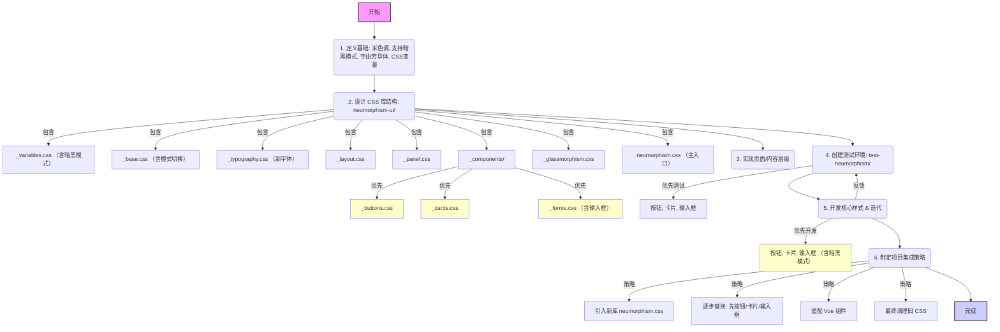

# Neumorphism CSS 基础库开发

**核心实现:** 创建一个名为 `neumorphism-ui` 的 CSS 基础库，采用 Neumorphism 风格（米色基调，支持暗黑模式），使用“字由芳华体”字体。

**核心要求:**

1.  **风格:** Neumorphism (新拟物)
2.  **颜色:** 基础色调偏米色，**需要支持暗黑模式**。
3.  **内容层级:** 强调、普通、弱化 (3 级)
4.  **页面层级:** 背景层、面板层、内容层、覆盖层 (玻璃拟态) (4 层)
5.  **字体:** **更换为“字由芳华体” (位于 `src/assets/fonts/字由芳华体.ttf`)**
6.  **集成方式:** **由控制器控制 Theme 主题**

**计划步骤:**

1.  **CSS 库结构设计:**
    *   在 `src/` 下创建新目录 `neumorphism-ui/`。
    *   在 `neumorphism-ui/` 内创建模块化 CSS 文件：
        *   `_variables.css`: 存储所有 CSS 变量。
        *   `_base.css`: 基础重置、`body` 样式（包含模式切换逻辑）、全局背景。
        *   `_typography.css`: 文本元素样式（使用新字体），体现内容层级。
        *   `_layout.css`: 页面层级结构类。
        *   `_panel.css`: 面板层样式。
        *   `_components/`: (拆分更细)
            *   `_buttons.css`: **优先开发**
            *   `_cards.css`: **优先开发**
            *   `_forms.css`: (包含输入框) **优先开发**
            *   ... (其他组件)
        *   `_glassmorphism.css`: 覆盖层玻璃拟态样式。
        *   `neumorphism.css`: 主入口文件，使用 `@import` 引入以上所有模块。

2.  **页面和内容层级实现:**
    *   **页面层级:**
        *   **背景层:** 在 `_base.css` 中设置 `body` 或根元素的背景色。
        *   **面板层:** 在 `_panel.css` 中创建如 `.neum-panel` 类，应用凸起的 Neumorphism 效果。
        *   **内容层:** 在 `_typography.css` 和 `_components/` 中定义元素样式。
        *   **覆盖层:** 在 `_glassmorphism.css` 中创建如 `.glass-overlay` 类，实现玻璃拟态。
    *   **内容层级:**
        *   在 `_variables.css` 中定义不同层级的文本颜色变量。
        *   在 `_typography.css` 中应用这些变量或创建工具类。

4.  **创建测试环境:**
    *   在 `src/` 下创建 `test-neumorphism/` 目录。
    *   创建 `test-neumorphism/index.html` 文件。
    *   创建 `test-neumorphism/test.css` 文件，用于 `@import '../neumorphism-ui/neumorphism.css';`。
    *   在 `index.html` 中引入 `test.css`。
    *   在 `index.html` 中**优先添加按钮、卡片、输入框**进行测试。

5.  **核心样式开发与迭代:**
    *   **优先完成 `_buttons.css`, `_cards.css`, `_forms.css` (输入框部分)** 的 Neumorphism 样式开发，**同时实现亮色和暗色模式**。
    *   在测试页面预览和调整。

6.  **项目集成策略:**
    *   **逐步替换:**
        *   首先在项目中引入 `neumorphism.css`。
        *   然后修改使用到按钮、卡片、输入框的 Vue 组件，移除旧样式，应用新类。
        *   验证无误后，再逐步开发和替换其他组件的样式。
        *   最后移除或清理旧的 CSS 文件 (`base.css`, `main.css`, `articlePage.css`)。

**可视化计划 (Mermaid Diagram):**

